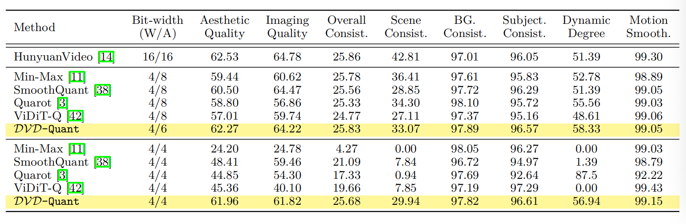

# DVD-Quant: Data-free Video Diffusion Transformers Quantization

[Zhiteng Li*](https://zhitengli.github.io), Hanxuan Li*, Junyi Wu, [Kai Liu](https://kai-liu001.github.io/), [Linghe Kong](https://www.cs.sjtu.edu.cn/~linghe.kong/), [Guihai Chen](https://cs.nju.edu.cn/gchen/index.htm), [Yulun Zhang](http://yulunzhang.com/) and [Xiaokang Yang](https://scholar.google.com/citations?user=yDEavdMAAAAJ)

---

> **Abstract:** Diffusion Transformers (DiTs) have emerged as the state-of-the-art architecture for video generation, yet their computational and memory demands hinder practical deployment. While post-training quantization (PTQ) presents a promising approach to accelerate Video DiT models, existing methods suffer from two critical limitations: (1) dependence on lengthy, computation-heavy calibration procedures, and (2) considerable performance deterioration after quantization. To address these challenges, we propose $\mathcal{DVD}$-Quant, a novel Data-free quantization framework for Video DiTs. Our approach integrates three key innovations: (1) **Progressive Bounded Quantization (PBQ)** and (2) **Auto-scaling Rotated Quantization(ARQ)** for calibration data-free quantization error reduction, as well as (3) **$\delta$-Guided Bit Switching ($\delta$-GBS)** for adaptive bit-width allocation. Extensive experiments across multiple video generation benchmarks demonstrate that $\mathcal{DVD}$-Quant achieves an approximately $2\times$ speedup over full-precision baselines on HunyuanVideo while maintaining visual fidelity. Notably, $\mathcal{DVD}$-Quant is the first to enable W4A4 PTQ for Video DiTs without compromising video quality.


# <a name="results"></a>🔎 Results

We are the first to enable W4A4 PTQ for Video DiTs without compromising video quality. Detailed results can be found in the paper.

<details>
<summary>&ensp;Quantitative Comparisons (click to expand) </summary>
<li> Performance comparison of various methods on VBench (Table 1 from the main paper). 
 
<p align="center">

</p>
</li>
</details>

<details open>
<summary>&ensp;More Comparisons across Different Methods (click to expand), * indicates 6 for DVD-Quant (W4A6) and 8 for other methods(W4A8) </summary>
<p align="center">

</p>
 
---
 
<p align="center">

</p>

---

<p align="center">

</p>


</details>

## Citation

If you find the code helpful in your research or work, please cite the following paper.

```
@article{li2025dvd,
  title={DVD-Quant: Data-free Video Diffusion Transformers Quantization},
  author={Li, Zhiteng and Li, Hanxuan and Wu, Junyi and Liu, Kai and Kong, Linghe and Chen, Guihai and Zhang, Yulun and Yang, Xiaokang},
  journal={arXiv preprint arXiv:2505.18663},
  year={2025}
}
```
